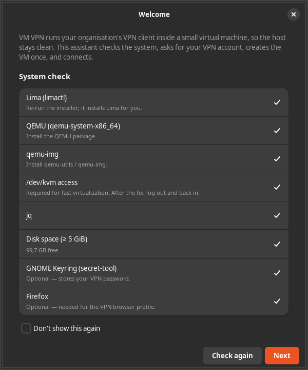
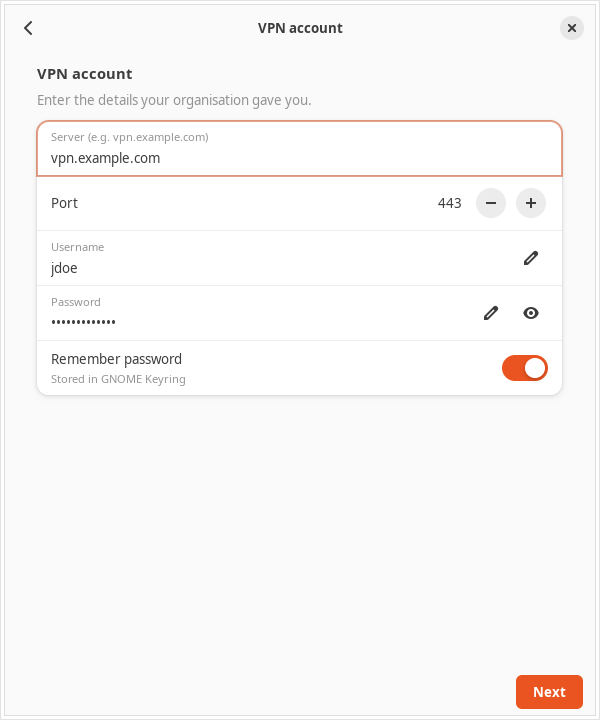
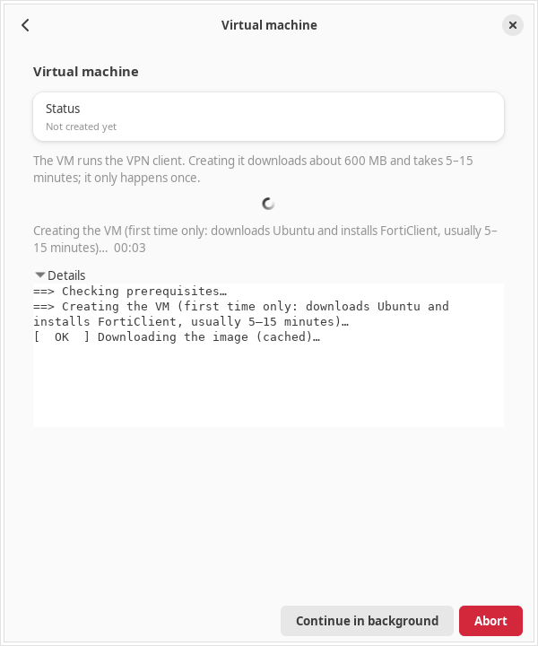
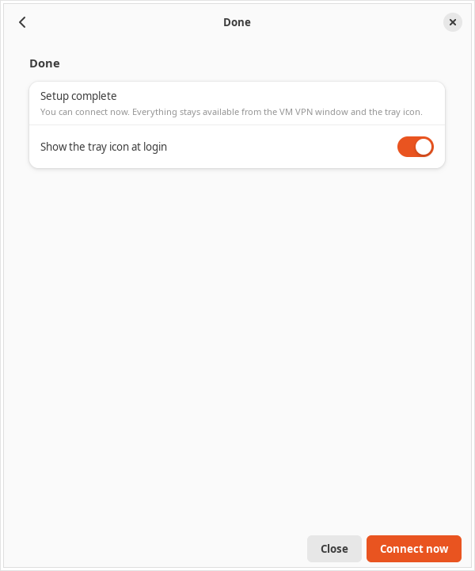
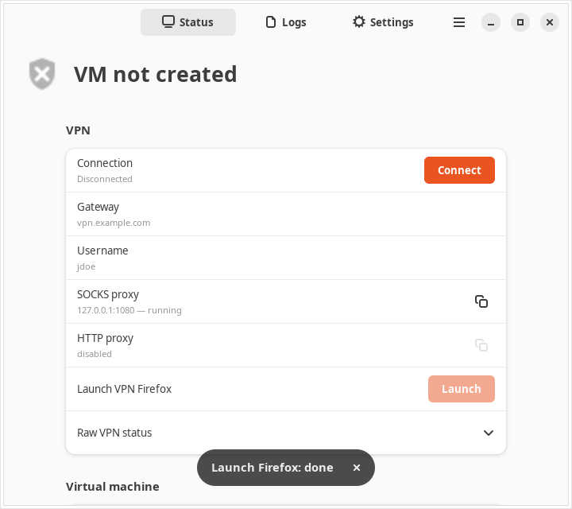

# VM VPN

**Connect to Fortinet VPNs from modern Linux distributions** — even when the official FortiClient doesn't support your system.

## Why This Project?

Fortinet's official Linux VPN client (FortiClient) often lags behind the latest Linux releases. If you're running **Ubuntu 24.10, 25.04, Fedora 40+**, or other recent distributions, you may find that:

- FortiClient packages won't install due to dependency issues
- The client crashes or fails to connect
- Fortinet simply doesn't provide packages for your distro version

**VM VPN solves this** by running FortiClient inside a lightweight Ubuntu 24.04 LTS virtual machine, then exposing the VPN connection to your host through proxy servers. Your browser and applications connect through the proxy — no need to install FortiClient directly on your system.


## Quick Start

### 1. Install

```bash
curl -fsSL https://raw.githubusercontent.com/carrerfe/vm-vpn/main/install.sh | bash
```

The installer does everything for you: it checks for QEMU and the other
system packages (and can install them for you — it may ask for your password
once), installs [Lima](https://lima-vm.io/) into `~/.local` without sudo, and
puts **VM VPN** in your app grid.

### 2. Using the app (recommended)

On a fresh install the **VM VPN** window opens by itself (or open it from
your apps). The **setup assistant** walks you through:

1. **System check** — verifies QEMU, Lima, KVM access and disk space.
2. **VPN account** — server, username and password (stored in GNOME Keyring).
3. **Create the VM** — a one-time step that downloads ~600 MB and takes
   5–15 minutes; progress is shown live.
4. **Connect** — done. Use **Launch VPN Firefox** to browse through the VPN.

<p>
  
  
</p>
<p>
  
  
</p>

The tray icon shows the state and offers Connect/Disconnect, VPN Firefox and
Settings.

### 3. Using the terminal

```bash
vmvpn setup            # interactive first-time setup (account + VM)
vmvpn vpn-connect      # connect (auto-starts the VM and proxies)
vmvpn firefox          # browse through the VPN
vmvpn vpn-disconnect   # disconnect
vmvpn ui               # open the app window (starts the tray too)
```

That's it! Firefox opens with a dedicated `vmvpn` profile that routes all
traffic through the VPN — your regular browser is unaffected.

## Troubleshooting

- **"VM will be very slow" / /dev/kvm errors** — add yourself to the `kvm`
  group: `sudo usermod -aG kvm $USER`, then log out and back in.
- **No tray icon on GNOME** — GNOME needs an AppIndicator extension
  (enabled by default on Ubuntu; Fedora:
  `sudo dnf install gnome-shell-extension-appindicator`). The window works
  without it.
- **Certificate prompt** — on the first connect, check the fingerprint shown
  against what your IT gave you, then trust it.
- **Login failed** — your password is wrong or expired; update it in the
  window (Settings) or run `vmvpn setup` again.
- **"Another vmvpn operation is in progress"** — a previous run is stuck;
  run `vmvpn abort` (or use the Abort button / Settings → Maintenance).
- **VM is stuck** — `vmvpn stop --force` (or Settings → Force stop VM).
- **See what's happening** — `vmvpn logs vpn` for the VPN log inside the VM,
  `vmvpn logs journal` for the guest system log, or the window's Logs page.
  GUI activity is in `~/.local/state/vmvpn/gui.log`.

## How It Works

1. **VM VPN** creates a small Ubuntu 24.04 VM with FortiClient pre-installed
2. When you run `vmvpn vpn-connect`, it connects to your corporate VPN inside the VM
3. A SOCKS5 proxy is started that tunnels traffic from your host through the VM
4. `vmvpn firefox` launches a browser configured to use this proxy

Your regular Firefox and other apps remain unaffected — only the dedicated VPN browser uses the tunnel.

## Features

- **Works on any Linux**: Ubuntu 24.10+, Fedora, Arch, etc.
- **No system modifications**: VPN runs isolated in a VM
- **Easy Firefox integration**: One command to browse through VPN
- **SOCKS5 & HTTP proxies**: Use with any application
- **Simple CLI**: `vpn-connect`, `vpn-disconnect`, `vpn-status`

## Manual installation

The installer normally handles this for you, but you can install the
dependencies by hand.

### System packages

**Ubuntu/Debian (x86_64):**
```bash
sudo apt install qemu-system-x86 qemu-utils ovmf jq openssh-client curl
# For the GUI:
sudo apt install python3-gi gir1.2-gtk-3.0 gir1.2-gtk-4.0 gir1.2-adw-1 \
    gir1.2-ayatanaappindicator3-0.1 gir1.2-notify-0.7 libsecret-tools
```

**Ubuntu/Debian (aarch64):**
```bash
sudo apt install qemu-system-arm qemu-utils qemu-efi-aarch64 jq openssh-client curl
```

**Fedora:**
```bash
sudo dnf install qemu-system-x86 qemu-img edk2-ovmf jq openssh-clients curl
# For the GUI:
sudo dnf install python3-gobject gtk3 gtk4 libadwaita \
    libayatana-appindicator-gtk3 libnotify libsecret
```

### Lima

If `limactl` is missing the installer downloads a pinned release (2.0.3)
into `~/.local` without sudo. To install it manually:

```bash
VERSION=2.0.3
curl -fsSL "https://github.com/lima-vm/lima/releases/download/v${VERSION}/lima-${VERSION}-$(uname -s)-$(uname -m).tar.gz" -o /tmp/lima.tar.gz
tar -xzf /tmp/lima.tar.gz -C /tmp
cp -R /tmp/bin /tmp/share ~/.local/   # puts limactl in ~/.local/bin
```

### Installer options

```bash
curl -fsSL https://raw.githubusercontent.com/carrerfe/vm-vpn/main/install.sh | bash
```

Installs to `~/.local/bin` (override with `VMVPN_INSTALL_DIR`). Useful
environment flags: `VMVPN_SKIP_DEPS=1` (skip the package check),
`VMVPN_ASSUME_YES=1` (never prompt), `VMVPN_NO_LAUNCH=1` (don't open the
app), `VMVPN_LIMA_VERSION` (pin a different Lima release), and
`VMVPN_REF` (git ref to install; default `main`). To install a specific
release:

```bash
curl -fsSL https://raw.githubusercontent.com/carrerfe/vm-vpn/v1.1.0/install.sh \
    | VMVPN_REF=v1.1.0 bash
```

## Architecture

```
┌──────────────────────────────────────────────────────────────────┐
│                         Host Machine                             │
│                                                                  │
│  ┌──────────┐                                                    │
│  │ Firefox  │──┐                                                 │
│  │ (vmvpn)  │  │                                                 │
│  └──────────┘  │                                                 │
│                │                                                 │
│  ┌──────────┐  │  SOCKS5 (localhost:1080)                        │
│  │  curl    │──┼─────────────────────────────┐                   │
│  │  apps    │  │                             │                   │
│  └──────────┘  │  HTTP (localhost:3128)      │                   │
│                └─────────────────────────┐   │                   │
└──────────────────────────────────────────┼───┼───────────────────┘
                                           │   │
┌──────────────────────────────────────────┼───┼───────────────────┐
│              Lima VM (Ubuntu 24.04 LTS)  │   │                   │
│                                          ▼   ▼                   │
│  ┌───────────────────────┐    ┌─────────────────────────────┐    │
│  │     Squid Proxy       │    │   SSH Dynamic Port Forward  │    │
│  │   (HTTP/HTTPS proxy)  │    │      (SOCKS5 proxy)         │    │
│  │     port 3128         │    │       port 1080             │    │
│  └───────────┬───────────┘    └──────────────┬──────────────┘    │
│              │                               │                   │
│              └───────────┬───────────────────┘                   │
│                          ▼                                       │
│                 ┌─────────────────┐                              │
│                 │  FortiClient    │                              │
│                 │     VPN         │────────▶ Corporate Network   │
│                 └─────────────────┘                              │
└──────────────────────────────────────────────────────────────────┘
```

**SOCKS5 Proxy** (recommended): SSH dynamic port forwarding (`ssh -D`). Runs on host, tunnels through VM. Best for browsers.

**HTTP Proxy**: Squid running inside the VM. Useful for apps that only support HTTP proxies or environment variables.

## Shell Completion

```bash
# Bash - add to ~/.bashrc
eval "$(./vmvpn completion bash)"

# Zsh - add to ~/.zshrc
eval "$(./vmvpn completion zsh)"
```

## Commands

### VM Commands
| Command          | Description                              |
|------------------|------------------------------------------|
| `setup`          | Interactive first-time setup (account + VM) |
| `start`          | Create and start the VM                  |
| `stop [-f]`      | Stop the VM (`-f`: abort stuck ops, force stop) |
| `restart`        | Restart the VM                           |
| `abort`          | Kill a stuck vmvpn operation (+ guest VPN helpers) |
| `shell`          | Open a shell in the VM                   |
| `ssh`            | Connect via SSH                          |
| `status`         | Show VM status (`--json` for machines)   |
| `delete [-y|-f]` | Delete the VM and all its data (`-f`: force) |
| `vm-apply [-y]`  | Apply the `vm` config section (may restart the VM) |
| `logs SOURCE [-n N] [-f]` | Guest logs: `vpn`, `journal`, `squid`, `forticlient` (`-f`: follow) |

### VPN Commands
| Command          | Description                              |
|------------------|------------------------------------------|
| `vpn-connect`    | Connect to VPN (auto-starts VM/proxies)  |
| `vpn-disconnect` | Disconnect from VPN (stops proxies)      |
| `vpn-status`     | Show VPN and proxy status                |
| `password-set`   | Store VPN password in GNOME keyring      |
| `password-clear` | Remove VPN password from GNOME keyring   |
| `cert-forget`    | Forget saved certificate fingerprint     |

### Browser Commands
| Command          | Description                              |
|------------------|------------------------------------------|
| `firefox`        | Launch Firefox with VPN proxy profile    |
| `firefox-profile`| Show Firefox profile info and deletion   |

### UI Commands
| Command                    | Description                          |
|----------------------------|--------------------------------------|
| `ui`                       | Open the app (starts the tray too)   |
| `ui status\|logs\|settings\|setup` | Open the app on a specific page |
| `ui stop`                  | Quit the app (window + tray)         |
| `ui tray [on\|off]`        | Show/hide the tray icon (persistent) |
| `ui setup-prompt [on\|off]`| Offer the setup assistant at login   |
| `vm-autostart [on\|off]`   | Start the VM at graphical login      |

The CLI owns the UI state: preferences live in
`~/.config/vmvpn/ui.json`, autostart entries in `~/.config/autostart/`, and
the window/tray processes are started and stopped by `vmvpn ui` itself —
the GUI never writes these files.

### Other Commands
| Command            | Description                    |
|--------------------|--------------------------------|
| `version`          | Print version (`--version`/`-V`) |
| `settings`         | Alias of `ui settings`         |
| `completion bash`  | Output bash completion script  |
| `completion zsh`   | Output zsh completion script   |

## Project Structure

```
.
├── vmvpn                   # CLI script
├── vmvpn.yaml              # Lima VM configuration
├── install.sh              # Installer / updater
├── vpn-config.json.example # VPN config template
├── vpn-config.json         # Your VPN credentials (gitignored)
├── gui/
│   ├── vmvpn_common.py     # Shared helpers (Gtk-free)
│   ├── vmvpn-tray          # GTK3 + AppIndicator tray icon
│   ├── vmvpn-window        # GTK4 + libadwaita window
│   ├── icons/              # Own full-colour status icons (no theme needed)
│   └── tests/              # Unit tests (no Gtk needed)
├── scripts/release.sh      # Release tagging helper
├── .githooks/pre-push      # Tag/version consistency check
└── README.md
```

## VM Specifications

- **OS**: Ubuntu 24.04 LTS (cloud image)
- **CPUs**: 2
- **Memory**: 512 MiB, sized for 6-8 GB edge hosts; optional guest swap (see Customization)
- **Disk**: 20 GiB
- **FortiClient**: 7.4.x (installed from official Fortinet repo)
- Pre-installed tools: `curl`, `wget`, `vim`, `htop`, `net-tools`, `iproute2`

## FortiClient VPN Usage

### VPN Config File

Create `vpn-config.json` with your VPN and proxy settings:

```json
{
  "gateway": "vpn.example.com",
  "port": 443,
  "username": "your-username",
  "socks_proxy": {
    "enabled": true,
    "port": 1080,
    "auto_start": true,
    "auto_stop": true
  },
  "http_proxy": {
    "enabled": false,
    "port": 3128,
    "auto_start": false,
    "auto_stop": false
  },
  "vm": {
    "cpus": 2,
    "memory_mib": 512,
    "disk_gib": 20,
    "swap_mib": 0,
    "swappiness": null
  }
}
```

- **password**: Optional. If omitted, the password is looked up in the GNOME keyring (see `password-set` below), or you'll be prompted interactively.
- **socks_proxy**: SOCKS5 proxy via SSH (recommended for browsers)
- **http_proxy**: Squid HTTP proxy
- **auto_start/auto_stop**: Control proxy lifecycle with VPN connect/disconnect
- **vm**: Optional VM resources. `cpus` (1..host CPUs), `memory_mib`
  (256..host RAM), `disk_gib` (5..2048 — used at creation; can only grow via
  `vmvpn vm-apply`), `swap_mib` (0 = no guest swap) and `swappiness`
  (null = kernel default). **Every key is managed only when set**: an omitted
  or null key leaves the VM/template value untouched — e.g. a VM created with
  `VMVPN_SWAP_SIZE` keeps its swap as long as `swap_mib` is absent.
  `VMVPN_SWAP_SIZE` / `VMVPN_SWAPPINESS` env vars count as set for the swap
  values.

> **Note:** `vpn-config.json` is gitignored to protect your credentials.
> Prefer storing the password in the GNOME keyring (`vmvpn password-set`)
> instead of the plaintext `password` field.

## Scripting / automation

The CLI is non-interactive friendly: when stdin is not a TTY it never blocks on
prompts — it uses the flags below and reports machine-parseable results.

```bash
vmvpn status --json                    # single JSON object (schema: 1)
printf '%s\n' "$PW" | vmvpn vpn-connect --password-stdin
vmvpn vpn-connect --trust-fingerprint AA:BB:...   # pre-trust a server cert
printf '%s\n' "$PW" | vmvpn password-set --stdin  # store in GNOME keyring
vmvpn password-clear                   # remove stored password
vmvpn cert-forget                      # forget saved certificate fingerprint
vmvpn delete -y                        # no confirmation prompt
vmvpn delete --force                   # abort stuck ops + force delete
vmvpn stop --force                     # abort stuck ops + force stop
vmvpn abort                            # kill a stuck vmvpn operation
vmvpn logs journal -n 200              # tail the guest journal
vmvpn logs squid                       # tail Squid cache/access logs
vmvpn logs forticlient                 # tail FortiClient logs
vmvpn logs vpn -f                      # stream the VPN connection log
```

`status --json` always exits 0 and reports one object:
`{schema, version, busy, vm{name,exists,status,dir,cpus,memory_bytes,disk_bytes}, vm_config{cpus,memory_mib,disk_gib,swap_mib,swappiness}, vm_pending_restart, guest{mem_total_bytes,mem_used_bytes,mem_available_bytes,swap_total_bytes,swap_used_bytes,squid_active}|null, vpn{state,raw}, proxies{socks{enabled,port,running},http{enabled,port,running}}, config{path,exists,valid,reason,gateway,port,username,password_source}, cert{path,fingerprint}, ui{tray_enabled,tray_running,window_running,setup_prompt}, vm_autostart, release{version,ref,commit,source,installed_at}|null}`.
`vpn.state` is `connected`/`disconnected`/`unknown`; `password_source` is `config`/`keyring`/`none` (the password itself is never printed).
`busy` is `true` while another `vmvpn` process holds the operation lock.
`vm_pending_restart` is `true` when the instance's cpus/memory/disk differ
from the `vm` config (apply with `vmvpn vm-apply`).

**Operation lock:** `start`, `stop`, `restart`, `delete`, `vm-apply`,
`vpn-connect` and `vpn-disconnect` take a non-blocking `flock` on
`${XDG_RUNTIME_DIR:-/tmp}/vmvpn-${VM_NAME}.lock`. If another vmvpn operation
is in progress they print `Another vmvpn operation is in progress` to stderr
and exit `6`. `status --json` exposes the same state as `busy` so callers can
poll without taking the lock. A stuck operation (e.g. a hung Lima or
FortiClient call) can be killed with `vmvpn abort`, which terminates the
lock holder's process tree and any stuck FortiClient helpers in the guest.

Password resolution order for `vpn-connect`: `--password-stdin` → `password`
in the config file → GNOME keyring (`service vmvpn`) → interactive prompt.

**Exit codes:** `0` success · `1` general/usage error · `2` VPN login failed ·
`3` server certificate needs confirmation (stdout prints
`VMVPN_CERT_UNTRUSTED new=<fp> saved=<fp>`) · `4` password required but none
available (stderr prints `VMVPN_PASSWORD_REQUIRED`) · `5` VPN config file
missing or invalid · `6` another vmvpn operation is in progress (see the
operation lock above).

**Environment:** `VPN_CONFIG` overrides the config path (default
`./vpn-config.json`); `VMVPN_VM_NAME` overrides the Lima VM name (default
`vmvpn`).

## Desktop GUI (GNOME / KDE)

The app is a single component managed through `vmvpn ui` — it consists of a
tray icon and a window, both started/stopped and configured by the CLI:

- **`vmvpn ui`** opens the window (and starts the tray icon when enabled).
- **`vmvpn ui tray on|off`** shows/hides the tray icon, now and at login.
- **`vmvpn ui setup-prompt on|off`** controls whether the app proposes the
  setup assistant at login while the VPN isn't configured (the assistant's
  "Don't show this again" checkbox drives the same preference).
- **`vmvpn vm-autostart on|off`** starts the VM at graphical login (needs an
  existing VM).

Internals — two GUI processes drive the CLI without a terminal:

- **`vmvpn-tray`** — a tray icon (StatusNotifierItem) with its own
  full-colour status icons (no icon theme needed). The menu shows the state
  line (click → Status page), Connect/Disconnect (also the middle-click
  target), "Launch VPN Firefox", "Settings…", "About VM VPN" and Quit. It
  also shows desktop notifications (connect, disconnect, login failed,
  certificate rejected, VPN connection lost, keyring-save failures).
- **`vmvpn-window`** — a GTK4/libadwaita window (also in the app grid as
  "VM VPN"). On first run (no VPN profile) it opens a **setup assistant**:
  system check → VPN account → create the VM → connect. It's also reachable
  via `vmvpn ui setup`, "Set up VPN…" on the Status page, and
  "Run setup assistant" in Settings. Pages:
  - **Status**: VM name/state/CPUs/memory/disk, guest memory + swap bars,
    Squid state, VPN state with Connect/Disconnect, proxy cards with copy
    buttons, Firefox launch, config/cert info, and an Abort button while an
    operation is running. Long operations (VM creation, connecting) show a
    live phase line, elapsed time and a "Details" expander.
  - **Logs**: "VPN (live)", FortiClient, Squid and guest journal streams
    (`vmvpn logs -f`, restarted/stopped automatically with the VM), plus GUI
    activity and Lima host logs — with a Follow toggle, copy, and
    open-folder.
  - **Settings**: edit `vpn-config.json` (gateway/port/username, proxies,
    certificate, startup, and the `vm` resources group with "Apply to VM"),
    with Apply/Revert and a keyring password store. A Maintenance group
    offers "Abort running operation", "Force stop VM" and "Delete VM".

`vmvpn ui settings` (or the `vmvpn settings` alias) opens the window on the
Settings page; `vmvpn ui status|logs|settings|setup` opens the other pages
(a second invocation reuses the running window).

Password dialogs offer "Remember in GNOME keyring"; when the server
certificate is new or changed you get a trust dialog showing the fingerprint
in monospace (a *changed* fingerprint is flagged as a possible MITM attack).

Both processes poll `vmvpn status --json`, respect the CLI operation lock
(`busy`), and write activity to `$XDG_STATE_HOME/vmvpn/gui.log`.

> **Why is the tray GTK3?** GTK4 has no tray API, and the GTK-free
> libayatana-appindicator-glib menus don't render on GNOME
> (AyatanaIndicators/libayatana-appindicator-glib#102, still open; GNOME's
> appindicator extension declined the GMenu-based protocol —
> ubuntu/gnome-shell-extension-appindicator#597). The tray therefore uses
> GTK3 + AyatanaAppIndicator3 in a separate process.

### Screenshots


*Status page while connected — VPN state, proxy endpoints, VM details.*


*Status page on a fresh setup — the **Create VM** button removes the dead end.*


*Logs page tailing the guest FortiClient log.*


*Settings page — connection and keyring password storage.*


*First-connection certificate trust dialog.*

### GUI dependencies

- Ubuntu/Debian: `sudo apt install python3-gi gir1.2-gtk-3.0 gir1.2-gtk-4.0
  gir1.2-adw-1 gir1.2-ayatanaappindicator3-0.1 gir1.2-notify-0.7
  libsecret-tools`
- Fedora: `sudo dnf install python3-gobject gtk3 gtk4 libadwaita
  libayatana-appindicator-gtk3 libnotify libsecret`
- GNOME needs the AppIndicator extension for the tray (enabled by default on
  Ubuntu; Fedora: `gnome-shell-extension-appindicator`). KDE Plasma shows the
  tray natively.

The installer checks these and prints hints; the CLI works without them.

### Uninstalling the GUI

```bash
vmvpn ui stop                                 # quit the app
vmvpn ui tray off; vmvpn vm-autostart off     # remove autostart entries
rm -rf ~/.local/bin/vmvpn-gui
rm -f ~/.local/share/applications/io.github.carrerfe.VmVpn.desktop
rm -f ~/.config/autostart/vmvpn-tray.desktop ~/.config/autostart/vmvpn-vm.desktop
rm -rf ~/.config/vmvpn                        # ui.json preferences
rm -f ~/.local/state/vmvpn/ui.log ~/.local/state/vmvpn/gui.log
```

### Manual Connection (Inside VM)

If you prefer to connect manually inside the VM:

```bash
./vmvpn shell

# Then inside the VM (run as non-root user):
/opt/forticlient/forticlient-cli vpn connect <profile-name> --username=<username>

# List VPN profiles
/opt/forticlient/forticlient-cli vpn list

# Check status
/opt/forticlient/forticlient-cli vpn status
```

## Proxy Servers

Two proxy options are available:

### SOCKS5 Proxy (Recommended)

SSH-based SOCKS5 proxy on port **1080** (default). Best for browsers.

```bash
# Test with curl
curl --socks5-hostname 127.0.0.1:1080 https://internal-site.example.com
```

### HTTP Proxy

Squid HTTP proxy on port **3128**. Enable in config if needed.

```bash
# Test with curl
curl -x http://127.0.0.1:3128 https://internal-site.example.com

# Set environment variables
export http_proxy=http://127.0.0.1:3128
export https_proxy=http://127.0.0.1:3128
```

### Firefox Integration

The easiest way to browse through the VPN:

```bash
# Launch Firefox with pre-configured proxy profile
./vmvpn firefox

# View profile info and deletion instructions
./vmvpn firefox-profile
```

This creates a dedicated `vmvpn` Firefox profile with proxy settings matching your config.

## Customization

VM resources are configured in the `vm` block of `vpn-config.json` (see
below) or from the window's Settings page ("Virtual machine" group →
"Apply to VM"). You do not normally need to edit `vmvpn.yaml`.

### Guest swap and VM resources

Guest swap and `vm.swappiness` are off by default. Configure them in the
`vm` block of `vpn-config.json` (see above) or via env vars:

```bash
VMVPN_SWAP_SIZE=4G VMVPN_SWAPPINESS=100 vmvpn start
```

Swap and swappiness are applied to the running guest on every `start` /
`vpn-connect` — only when the keys are set, so changing `swap_mib`/
`swappiness` in the config takes effect without recreating the VM (and an
existing guest swap is never removed unless `swap_mib` is explicitly set).
CPU/memory/disk changes require a restart — run `vmvpn vm-apply` (it refuses
to shrink the disk, and only restarts when a managed key differs).
`status --json` reports the managed values in `vm_config` (null = unmanaged)
and flags pending resource changes with `vm_pending_restart`.

## Releasing

`scripts/release.sh X.Y.Z` bumps `VMVPN_VERSION` (in `vmvpn`) and `VERSION`
(in `gui/vmvpn_common.py`), runs the unit tests, commits `release: vX.Y.Z`
and creates the annotated tag `vX.Y.Z`. It requires a clean tree and a
version ≥ the latest reachable `v*` tag. It never pushes; it prints the
push commands (`origin` and `gitlab`).

A `pre-push` hook rejects a `vX.Y.Z` tag whose commit doesn't carry that
version in `VMVPN_VERSION`. Enable it once per clone:

```bash
git config core.hooksPath .githooks
```

Installs record where they came from in `vmvpn-gui/release.json`
(version, git ref, commit, install date); `vmvpn --version` and
`vmvpn status --json` expose it.

## License

MIT
