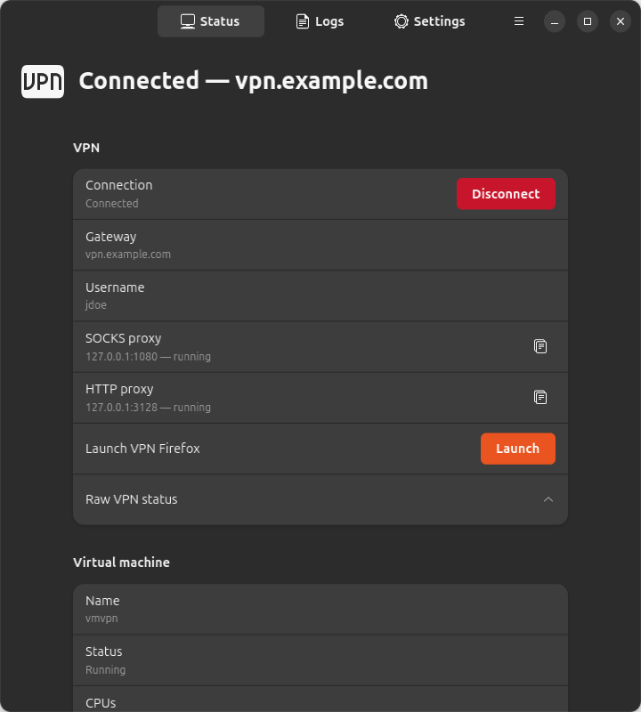
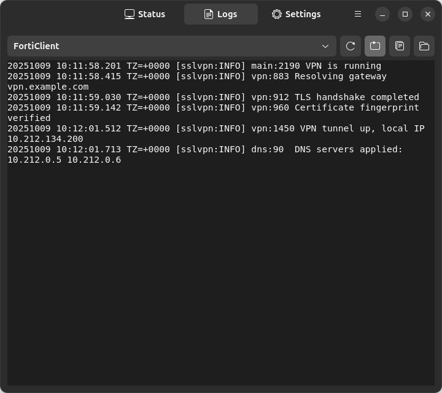
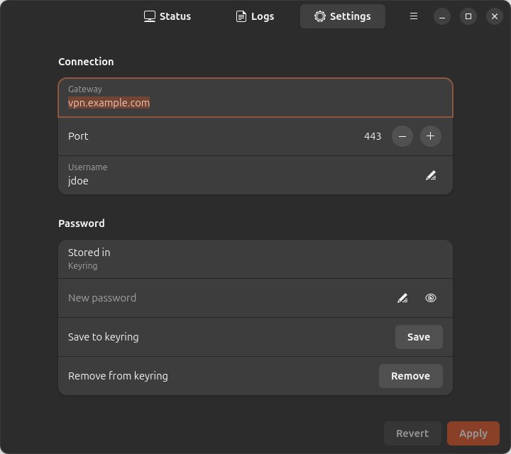
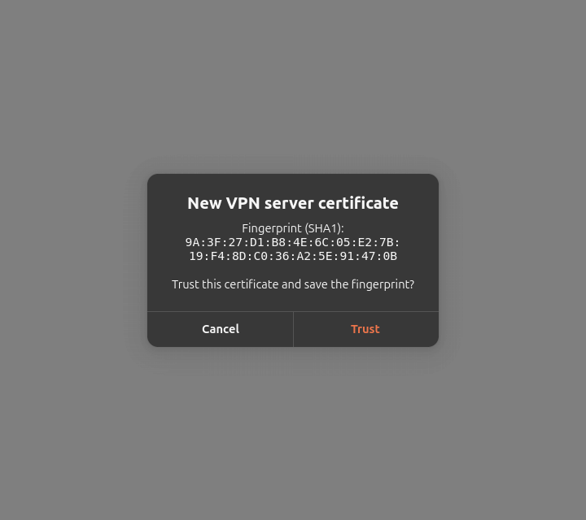

# VM VPN

**Connect to Fortinet VPNs from modern Linux distributions** — even when the official FortiClient doesn't support your system.

## Why This Project?

Fortinet's official Linux VPN client (FortiClient) often lags behind the latest Linux releases. If you're running **Ubuntu 24.10, 25.04, Fedora 40+**, or other recent distributions, you may find that:

- FortiClient packages won't install due to dependency issues
- The client crashes or fails to connect
- Fortinet simply doesn't provide packages for your distro version

**VM VPN solves this** by running FortiClient inside a lightweight Ubuntu 24.04 LTS virtual machine, then exposing the VPN connection to your host through proxy servers. Your browser and applications connect through the proxy — no need to install FortiClient directly on your system.

## Quick Start (5 minutes)

**Prerequisites:** You need [QEMU](https://www.qemu.org/), [Lima](https://lima-vm.io/) (a lightweight VM manager), and `jq` installed.

```bash
# 1. Install dependencies (one-time setup)
sudo apt install qemu-system jq                    # Install QEMU and jq (Ubuntu/Debian)

VERSION=$(curl -fsSL https://api.github.com/repos/lima-vm/lima/releases/latest | jq -r .tag_name)
curl -fsSL "https://github.com/lima-vm/lima/releases/download/${VERSION}/lima-${VERSION:1}-$(uname -s)-$(uname -m).tar.gz" | sudo tar Cxzvm /usr/local

# 2. Install vm-vpn
curl -fsSL https://raw.githubusercontent.com/carrerfe/vm-vpn/main/install.sh | bash

# 3. Configure your VPN credentials
cp ~/.local/bin/vpn-config.json.example ~/.local/bin/vpn-config.json
nano ~/.local/bin/vpn-config.json   # Edit with your VPN server and username

# 4. Connect!
vmvpn vpn-connect

# 5. Browse through the VPN
vmvpn firefox
```

That's it! Firefox will open with a special profile that routes all traffic through the VPN.

> Prefer a GUI? The installer also sets up **VM VPN** in your app grid
> (`vmvpn-window`) and a tray icon (`vmvpn-tray`) — see
> [Desktop GUI](#desktop-gui-gnome--kde).

## How It Works

1. **VM VPN** creates a small Ubuntu 24.04 VM with FortiClient pre-installed
2. When you run `vmvpn vpn-connect`, it connects to your corporate VPN inside the VM
3. A SOCKS5 proxy is started that tunnels traffic from your host through the VM
4. `vmvpn firefox` launches a browser configured to use this proxy

Your regular Firefox and other apps remain unaffected — only the dedicated VPN browser uses the tunnel.

## Features

- **Works on any Linux**: Ubuntu 24.10+, Fedora, Arch, etc.
- **No system modifications**: VPN runs isolated in a VM
- **Easy Firefox integration**: One command to browse through VPN
- **SOCKS5 & HTTP proxies**: Use with any application
- **Simple CLI**: `vpn-connect`, `vpn-disconnect`, `vpn-status`

## Installation (Alternative)

```bash
curl -fsSL https://raw.githubusercontent.com/carrerfe/vm-vpn/main/install.sh | bash
```

This installs to `~/.local/bin`. Set `VMVPN_INSTALL_DIR` to customize.

## Requirements

- [QEMU](https://www.qemu.org/) - required VM backend for Lima
- [Lima](https://lima-vm.io/) - lightweight Linux virtual machines on Linux/macOS
- jq (for JSON config parsing)

### Install Dependencies

**Linux (Ubuntu/Debian):**
```bash
# 1. Install QEMU and jq
sudo apt install qemu-system jq

# 2. Install Lima (binary from GitHub releases)
VERSION=$(curl -fsSL https://api.github.com/repos/lima-vm/lima/releases/latest | jq -r .tag_name)
curl -fsSL "https://github.com/lima-vm/lima/releases/download/${VERSION}/lima-${VERSION:1}-$(uname -s)-$(uname -m).tar.gz" | sudo tar Cxzvm /usr/local
```

**Linux (Fedora/RHEL):**
```bash
# 1. Install QEMU and jq
sudo dnf install qemu-system-x86 jq

# 2. Install Lima (binary from GitHub releases)
VERSION=$(curl -fsSL https://api.github.com/repos/lima-vm/lima/releases/latest | jq -r .tag_name)
curl -fsSL "https://github.com/lima-vm/lima/releases/download/${VERSION}/lima-${VERSION:1}-$(uname -s)-$(uname -m).tar.gz" | sudo tar Cxzvm /usr/local
```

**macOS:**
```bash
brew install lima jq
# QEMU is installed automatically by Homebrew as a Lima dependency
```

## Architecture

```
┌──────────────────────────────────────────────────────────────────┐
│                         Host Machine                             │
│                                                                  │
│  ┌──────────┐                                                    │
│  │ Firefox  │──┐                                                 │
│  │ (vmvpn)  │  │                                                 │
│  └──────────┘  │                                                 │
│                │                                                 │
│  ┌──────────┐  │  SOCKS5 (localhost:1080)                        │
│  │  curl    │──┼─────────────────────────────┐                   │
│  │  apps    │  │                             │                   │
│  └──────────┘  │  HTTP (localhost:3128)      │                   │
│                └─────────────────────────┐   │                   │
└──────────────────────────────────────────┼───┼───────────────────┘
                                           │   │
┌──────────────────────────────────────────┼───┼───────────────────┐
│              Lima VM (Ubuntu 24.04 LTS)  │   │                   │
│                                          ▼   ▼                   │
│  ┌───────────────────────┐    ┌─────────────────────────────┐    │
│  │     Squid Proxy       │    │   SSH Dynamic Port Forward  │    │
│  │   (HTTP/HTTPS proxy)  │    │      (SOCKS5 proxy)         │    │
│  │     port 3128         │    │       port 1080             │    │
│  └───────────┬───────────┘    └──────────────┬──────────────┘    │
│              │                               │                   │
│              └───────────┬───────────────────┘                   │
│                          ▼                                       │
│                 ┌─────────────────┐                              │
│                 │  FortiClient    │                              │
│                 │     VPN         │────────▶ Corporate Network   │
│                 └─────────────────┘                              │
└──────────────────────────────────────────────────────────────────┘
```

**SOCKS5 Proxy** (recommended): SSH dynamic port forwarding (`ssh -D`). Runs on host, tunnels through VM. Best for browsers.

**HTTP Proxy**: Squid running inside the VM. Useful for apps that only support HTTP proxies or environment variables.

## Quick Start

```bash
# 1. Create your VPN config
cp vpn-config.json.example vpn-config.json
# Edit vpn-config.json with your credentials

# 2. Connect to VPN (auto-starts VM and proxies)
./vmvpn vpn-connect

# 3. Launch Firefox with VPN proxy
./vmvpn firefox

# 4. Check status
./vmvpn vpn-status

# 5. Disconnect when done
./vmvpn vpn-disconnect
```

## Shell Completion

```bash
# Bash - add to ~/.bashrc
eval "$(./vmvpn completion bash)"

# Zsh - add to ~/.zshrc
eval "$(./vmvpn completion zsh)"
```

## Commands

### VM Commands
| Command          | Description                              |
|------------------|------------------------------------------|
| `start`          | Create and start the VM                  |
| `stop`           | Stop the VM                              |
| `restart`        | Restart the VM                           |
| `shell`          | Open a shell in the VM                   |
| `ssh`            | Connect via SSH                          |
| `status`         | Show VM status (`--json` for machines)   |
| `delete [-y]`    | Delete the VM and all its data           |
| `logs SOURCE [-n N]` | Tail guest logs: `journal`, `squid`, `forticlient` |

### VPN Commands
| Command          | Description                              |
|------------------|------------------------------------------|
| `vpn-connect`    | Connect to VPN (auto-starts VM/proxies)  |
| `vpn-disconnect` | Disconnect from VPN (stops proxies)      |
| `vpn-status`     | Show VPN and proxy status                |
| `password-set`   | Store VPN password in GNOME keyring      |
| `password-clear` | Remove VPN password from GNOME keyring   |
| `cert-forget`    | Forget saved certificate fingerprint     |

### Browser Commands
| Command          | Description                              |
|------------------|------------------------------------------|
| `firefox`        | Launch Firefox with VPN proxy profile    |
| `firefox-profile`| Show Firefox profile info and deletion   |

### Other Commands
| Command            | Description                    |
|--------------------|--------------------------------|
| `version`          | Print version (`--version`/`-V`) |
| `completion bash`  | Output bash completion script  |
| `completion zsh`   | Output zsh completion script   |

## Project Structure

```
.
├── vmvpn                   # CLI script
├── vmvpn.yaml              # Lima VM configuration
├── install.sh              # Installer / updater
├── vpn-config.json.example # VPN config template
├── vpn-config.json         # Your VPN credentials (gitignored)
├── gui/
│   ├── vmvpn_common.py     # Shared helpers (Gtk-free)
│   ├── vmvpn-tray          # GTK3 + AppIndicator tray icon
│   ├── vmvpn-window        # GTK4 + libadwaita window
│   └── tests/              # Unit tests (no Gtk needed)
└── README.md
```

## VM Specifications

- **OS**: Ubuntu 24.04 LTS (cloud image)
- **CPUs**: 2
- **Memory**: 512 MiB, sized for 6-8 GB edge hosts; optional guest swap (see Customization)
- **Disk**: 20 GiB
- **FortiClient**: 7.4.x (installed from official Fortinet repo)
- Pre-installed tools: `curl`, `wget`, `vim`, `htop`, `net-tools`, `iproute2`

## FortiClient VPN Usage

### VPN Config File

Create `vpn-config.json` with your VPN and proxy settings:

```json
{
  "gateway": "vpn.example.com",
  "port": 443,
  "username": "your-username",
  "socks_proxy": {
    "enabled": true,
    "port": 1080,
    "auto_start": true,
    "auto_stop": true
  },
  "http_proxy": {
    "enabled": false,
    "port": 3128,
    "auto_start": false,
    "auto_stop": false
  }
}
```

- **password**: Optional. If omitted, the password is looked up in the GNOME keyring (see `password-set` below), or you'll be prompted interactively.
- **socks_proxy**: SOCKS5 proxy via SSH (recommended for browsers)
- **http_proxy**: Squid HTTP proxy
- **auto_start/auto_stop**: Control proxy lifecycle with VPN connect/disconnect

> **Note:** `vpn-config.json` is gitignored to protect your credentials.
> Prefer storing the password in the GNOME keyring (`vmvpn password-set`)
> instead of the plaintext `password` field.

## Scripting / automation

The CLI is non-interactive friendly: when stdin is not a TTY it never blocks on
prompts — it uses the flags below and reports machine-parseable results.

```bash
vmvpn status --json                    # single JSON object (schema: 1)
printf '%s\n' "$PW" | vmvpn vpn-connect --password-stdin
vmvpn vpn-connect --trust-fingerprint AA:BB:...   # pre-trust a server cert
printf '%s\n' "$PW" | vmvpn password-set --stdin  # store in GNOME keyring
vmvpn password-clear                   # remove stored password
vmvpn cert-forget                      # forget saved certificate fingerprint
vmvpn delete -y                        # no confirmation prompt
vmvpn logs journal -n 200              # tail the guest journal
vmvpn logs squid                       # tail Squid cache/access logs
vmvpn logs forticlient                 # tail FortiClient logs
```

`status --json` always exits 0 and reports one object:
`{schema, busy, vm{name,exists,status,dir,cpus,memory_bytes,disk_bytes}, guest{mem_total_bytes,mem_used_bytes,mem_available_bytes,swap_total_bytes,swap_used_bytes,squid_active}|null, vpn{state,raw}, proxies{socks{enabled,port,running},http{enabled,port,running}}, config{path,exists,valid,gateway,port,username,password_source}, cert{path,fingerprint}}`.
`vpn.state` is `connected`/`disconnected`/`unknown`; `password_source` is `config`/`keyring`/`none` (the password itself is never printed).
`busy` is `true` while another `vmvpn` process holds the operation lock.

**Operation lock:** `start`, `stop`, `restart`, `delete`, `vpn-connect` and
`vpn-disconnect` take a non-blocking `flock` on
`${XDG_RUNTIME_DIR:-/tmp}/vmvpn-${VM_NAME}.lock`. If another vmvpn operation
is in progress they print `Another vmvpn operation is in progress` to stderr
and exit `6`. `status --json` exposes the same state as `busy` so callers can
poll without taking the lock.

Password resolution order for `vpn-connect`: `--password-stdin` → `password`
in the config file → GNOME keyring (`service vmvpn`) → interactive prompt.

**Exit codes:** `0` success · `1` general/usage error · `2` VPN login failed ·
`3` server certificate needs confirmation (stdout prints
`VMVPN_CERT_UNTRUSTED new=<fp> saved=<fp>`) · `4` password required but none
available (stderr prints `VMVPN_PASSWORD_REQUIRED`) · `5` VPN config file
missing or invalid · `6` another vmvpn operation is in progress (see the
operation lock above).

**Environment:** `VPN_CONFIG` overrides the config path (default
`./vpn-config.json`); `VMVPN_VM_NAME` overrides the Lima VM name (default
`vmvpn`).

## Desktop GUI (GNOME / KDE)

Two GUI front-ends drive the CLI without a terminal:

- **`vmvpn-tray`** — a tray icon (StatusNotifierItem). Shows VPN/VM state at a
  glance and offers Connect/Disconnect, proxy-address copy, "Launch VPN
  Firefox", Start/Stop VM, "Open VM VPN…", a "Start at login" autostart
  toggle, and Quit. It also shows desktop notifications (connect, disconnect,
  login failed, certificate rejected, VPN connection lost).
- **`vmvpn-window`** — a GTK4/libadwaita window (also in the app grid as
  "VM VPN") with three pages:
  - **Status**: VM name/state/CPUs/memory/disk, guest memory + swap bars,
    Squid state, VPN state with Connect/Disconnect, proxy cards with copy
    buttons, Firefox launch, config/cert info.
  - **Logs**: GUI activity, Lima host-agent and serial logs, and guest
    `journal`/`squid`/`forticlient` logs, with tail-view, auto-refresh,
    copy, and open-folder.
  - **Settings**: edit `vpn-config.json` (gateway/port/username, proxies,
    certificate, startup), with Apply/Revert and a keyring password store.

Password dialogs offer "Remember in GNOME keyring"; when the server
certificate is new or changed you get a trust dialog showing the fingerprint
in monospace (a *changed* fingerprint is flagged as a possible MITM attack).

Both processes poll `vmvpn status --json`, respect the CLI operation lock
(`busy`), and write activity to `$XDG_STATE_HOME/vmvpn/gui.log`.

> **Why is the tray GTK3?** GTK4 has no tray API, and the GTK-free
> libayatana-appindicator-glib menus don't render on GNOME
> (AyatanaIndicators/libayatana-appindicator-glib#102, still open; GNOME's
> appindicator extension declined the GMenu-based protocol —
> ubuntu/gnome-shell-extension-appindicator#597). The tray therefore uses
> GTK3 + AyatanaAppIndicator3 in a separate process.

### Screenshots


*Status page while connected — VPN state, proxy endpoints, VM details.*


*Logs page tailing the guest FortiClient log.*


*Settings page — connection and keyring password storage.*


*First-connection certificate trust dialog.*

### GUI dependencies

- Ubuntu/Debian: `sudo apt install python3-gi gir1.2-gtk-3.0 gir1.2-gtk-4.0
  gir1.2-adw-1 gir1.2-ayatanaappindicator3-0.1 gir1.2-notify-0.7
  libsecret-tools`
- Fedora: `sudo dnf install python3-gobject gtk3 gtk4 libadwaita
  libayatana-appindicator-gtk3 libnotify libsecret`
- GNOME needs the AppIndicator extension for the tray (enabled by default on
  Ubuntu; Fedora: `gnome-shell-extension-appindicator`). KDE Plasma shows the
  tray natively.

The installer checks these and prints hints; the CLI works without them.

### Uninstalling the GUI

```bash
rm -f ~/.local/bin/vmvpn-tray ~/.local/bin/vmvpn-window
rm -rf ~/.local/bin/vmvpn-gui
rm -f ~/.local/share/applications/io.github.carrerfe.VmVpn.desktop
rm -f ~/.config/autostart/vmvpn-tray.desktop   # if "Start at login" was on
```

### Manual Connection (Inside VM)

If you prefer to connect manually inside the VM:

```bash
./vmvpn shell

# Then inside the VM (run as non-root user):
/opt/forticlient/forticlient-cli vpn connect <profile-name> --username=<username>

# List VPN profiles
/opt/forticlient/forticlient-cli vpn list

# Check status
/opt/forticlient/forticlient-cli vpn status
```

## Proxy Servers

Two proxy options are available:

### SOCKS5 Proxy (Recommended)

SSH-based SOCKS5 proxy on port **1080** (default). Best for browsers.

```bash
# Test with curl
curl --socks5-hostname 127.0.0.1:1080 https://internal-site.example.com
```

### HTTP Proxy

Squid HTTP proxy on port **3128**. Enable in config if needed.

```bash
# Test with curl
curl -x http://127.0.0.1:3128 https://internal-site.example.com

# Set environment variables
export http_proxy=http://127.0.0.1:3128
export https_proxy=http://127.0.0.1:3128
```

### Firefox Integration

The easiest way to browse through the VPN:

```bash
# Launch Firefox with pre-configured proxy profile
./vmvpn firefox

# View profile info and deletion instructions
./vmvpn firefox-profile
```

This creates a dedicated `vmvpn` Firefox profile with proxy settings matching your config.

## Customization

Edit `vmvpn.yaml` to customize:

```yaml
cpus: 2          # Number of CPUs
memory: "512MiB" # RAM allocation
disk: "20GiB"    # Disk size
```

### Guest swap

Guest swap and `vm.swappiness` are off by default. Enable them when the VM
is created:

```bash
VMVPN_SWAP_SIZE=4G VMVPN_SWAPPINESS=100 vmvpn start
```

Both are baked into the instance at creation. To change them on an existing
VM, recreate it: `vmvpn delete`, then start again with the variables set.

## License

MIT
